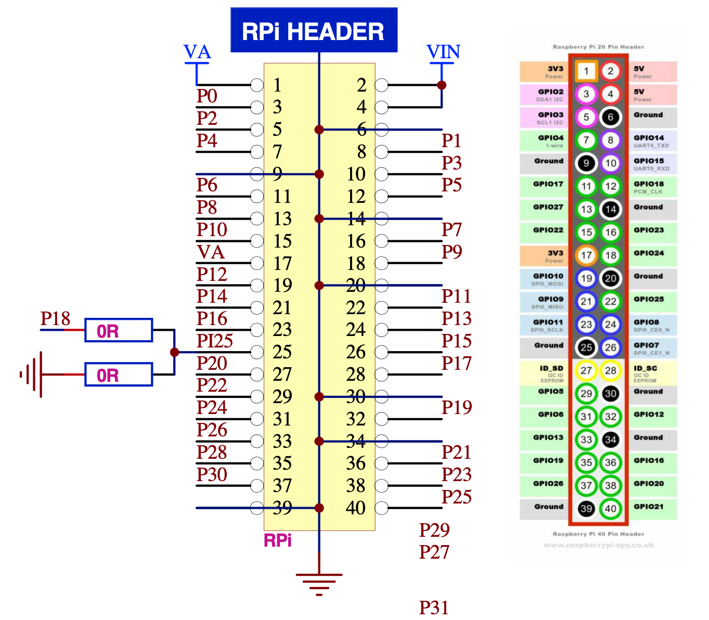

# RPi-P2D2-Support
![Project Maintenance][maintenance-shield]

[![GitHub Activity][commits-shield]][commits]

[](https://www.gnu.org/licenses/gpl-3.0)

Useful information for using P2D2 (parallax Propeller V2) with Raspberry Pi.

I'm continually adding to this document as I "Learn things."

As you likely already know **Peter Jakacki's** P2D2 Boards are arriving with a 3rd header, matching the Raspberry Pi GPIO pinout, outboard of the two P2D2 headers already present. This allows the P2D2 to be plugged into the Raspbery Pi just like many other RPi Hats.

The P2D2 Plugs into the RPi GPIO Header and provides the following connections:

## The Hardware 

### Pins that are connected to the RPi

By plugging the P2D2 onto the RPi header the board is immediately connected to a number of useful interfaces and a new world of opportunity.

|  RPi Interface | # of Pins | Purpose | P2 Pins |
| ---------- | -------------- | -------------------- | ---- |
| I2C(1) | 2 pins | SDA, SCL | P0, P2 |
| 1-wire | 1 pin | 1-wire | P4 |
| UART(0) | 2 pins | TxD, RxD| P1, P3 |
| PCM | 1 pin? | PCM CLK | P5 |
| SPI(0) | 5 pins | MOSI, MISO, SCLK, !CE0, !CE1 | P12-P16 |
| I2C ID | 2 Pins | ID_SC, ID_SD  | P17, P20 |
| GPIOs | 15 pins | Unclaimed I/O | P6-P11, P19, P21-P26, P28, P30 | 

### Diagram of connections to RPi

Here is the header as shown in Peter's P2D2 r5 documents:



Things we are learning:

| RPi Interface | max clock freq |
| ------------- | -------------- |
| I2C(1) | 400 KHz |
| 1-wire | ??? |
| UART(0) | > 2 MHz |
| SPI(0) | 125 MHz |
| I2C ID | 400 KHz |

*I'll keep adjusting this table as I learn more...*

## The Raspberry Pi (RPi)

Raspberry Pi's are fairly inexpensive devices and all software for them, operating system, applications are free.  RPi's such at the RPi4 with its 8GB ram is touted to be a nearly desktop class linux machine. It is well connected, offering WiFi, wired ethernet, and bluetooth interfaces, USB 2.0 and 3.0. It has wonderfully high resolution (up to 4k 60fps) HDMI output and it has world class open source data analysis and visualization tools available at no cost (open source.)

There many different models of the Raspberry Pi. It can be hard to know what capabilities you have on a specific instance of RPi that you may have.

Here are two sources i like to use when I need more detail on one of mine:

The WikipediA page: [Raspberry Pi](https://en.wikipedia.org/wiki/Raspberry_Pi)

and the FAQ Rasperrypi.org page: [FAQs](https://www.raspberrypi.org/documentation/faqs/) which leads me to many more useful details.

### Configuration Opportunities

We will continually be identifying fun and unique ways to use this hardware pairing. Here i'm starting a list of obvious opportunities I see I'm studying all connections for this pairing.

This will be an ever growing list of things that are possible now with a bit of configuration of the PRi and maybe some lightweight code for the P2 or the RPi:

- Debug console while running apps on P2D2.
- Root access console to the RPi for apps running on the P2D2.
- Boot time ID ROM emulation so the RPi can do HAT (Hardware on Top) runtime configuration of drivers.
- ... many more tba ...

Then there are things we'd like to do but have yet to figure out how:

- Boot-time access to TAQOZ on the P2 from the RPi - would allow us to debug P2 attached hardware using TAQOZ.
- ... more as we find ...

# Hardware Interaction leading to configuration Choices

As with any embedded system with many I/O choices sometimes tradeoffs have to be made to use certain capabilities (to get one to operate maybe you have to disable another, etc.)  I put this README together so I could annotate here for us all any such tradeoff issues I find.  So far, the Serial port is the one where we have more choices to make. The following sections (one for each interface) provide any details I've found to date.

**NOTE: the number of SPI, I2C, or UARTs you have** depends upon the model of Broadcom SoC chip used on your RPi [[BCM2711](https://www.raspberrypi.org/documentation/hardware/raspberrypi/bcm2711/README.md), [BCM2835](https://www.raspberrypi.org/documentation/hardware/raspberrypi/bcm2835/README.md), [BCM2836](https://www.raspberrypi.org/documentation/hardware/raspberrypi/bcm2836/README.md), BCM2837A0, [BCM2837B0](https://www.raspberrypi.org/documentation/hardware/raspberrypi/bcm2837b0/README.md), etc.].  Go to [The computer hardware](https://www.raspberrypi.org/documentation/faqs/#hardware) section of the RPi FAQ to determing which you have!

Or, have a little fun with entering this on your RPi in question:

```shell
cat /proc/cpuinfo | grep Hardware
```

(*your RPi whill tell you which BCM chip it has!*)

**NOTE: Turn on Interfaces you need.** The hardware interfaces at the GPIO connector are generally turned off by default. You will want to use **raspi-config** to enable each of the interfaces you wish to use.  

**Language Choices:** I tend to use Python or ANSI C for interacting with the various devices as there are a lot of rich examples and library support. However there are a number of other languages you could choose to use.  

**NOTE:** While most software including Python itself is installed using **apt-get install {package}** Some of the lesser used Python packages will need to be installed using using **pip(3) install {package}** as they may not be prepackaged for **apt-get** installation.


## Interface: I2C0
Enable the I2C interface using raspi-config. From what I can find, by default the I2C clock is 100KHz. This can be adjusted up to a max of 400KHz. <sup name="ai1">[I1](#fi1)</sup>  Also, there are posts that suggest that I2C on the RPi can only work at these two frequencies.<sup name="ai2">[I2](#fi2)</sup>

There are 

By default some useful I2C tools are not installed.  Install them with:

```shell
sudo apt-get update
sudo apt-get install i2c-tools
```

The most commonly used Python library appears to be [SMBus](https://pypi.org/project/smbus2/) which is installable on our RPi's using `sudo apt-get install python3-smbus`.  The project website has examples of use and there are many other open source projects using it as well which serve as good examples.

### I2C Clock Speed

we modify the I2C clock speed by adjusting values in the in `/boot/config.txt` file.
Look for:

```shell
dtparam=i2c_arm=on
``` 

and add a new line setting the desired clock speed:

```shell
dtparam=i2c_arm=on
i2c_arm_baudrate=400000
``` 

This selects our new 400Kb/s rate.

*Please remember that after adjusting these /boot/ files your changes do not take affect until you reboot the RPi.*

### I2C Enabled Check

It is easy to tell if you already have the I2C interface enabled using a simply command:

```
ls /dev/i2c*
# which yields somthing like (only if the driver is loaded):
crw-rw---- 1 root i2c 89, 1 Sep  1 13:17 /dev/i2c-1

```

**NOTE:** Our I2C0 interface is `/dev/i2c-1`.


## Interface: 1-Wire

Enable the 1-wire interface using raspi-config. There are options for enabling a pull-up on the GPIO pin but most people just wire up their own external resistor.  The driver should default to the GPIO4 pin but it never hurts to double check. <sup name="ao1">[O1](#fo1)</sup>

## Interface: Serial: UART0
There are two hardware UARTs: miniUART and PL011 that are configured to be primary and secondary on RPi3 and RPI4. (earlier models are different!) <sup name="au1">[U1](#fu1)</sup> and four additional UARTs [2-5] <sup name="au2">[U2](#fu2)</sup>.

### MiniUART (less capable, but fully meets our normal debugging needs)

The **miniUART** is configured to be the primary and is by default routed to UART0 (at the GPIO connector), it is disabled but is configured, when enabled, to be a serial console with full command line access. The clock for this miniUART is derived from the CPU clock so it can be affected by temperature throttleing or overclocking.  (It appears on device files: /dev/serial0, /dev/ttyS0)

Considerations for use: 

* This MiniUART is easily capable of our P2 deafult 2MBit 8N1 configuration (it can go higher)
* We need to fix the cpu clock fequency so it can not cause our miniUART to change frequencies while we are using it.
* We need to set the input clock frequency to the miniUART to get to our 2Mbit rate

### PL011 UART (more capable)
The second and more capable UART is the **PL011 UART**. This is configured to be the Bluetooth LE serial transceiver and is the secondary serial device. (It appears on device files: /dev/serial01, /dev/ttyAMA0)

Considerations for use: 

* The PL011 UART is also capable of our P2 deafult 2MBit 8N1 configuration (it too can go higher)
* If we want to use this UART as UART0 then we need to flip the miniUART to handle the Bluetooth LE device and PL011 to be the primary connecting it to UART0 at our GPIO header.  Alternatively, we can just disable the bluetooth to cause this to happen as well.

### Serial Boot-time Configuration

Two files are involved in configuration of serial port use: /boot/config.txt and /boot/cmdline.txt

As an RPi user it is probably cleaner to make as much configuration change as you can using 'sudo raspi-config' utility. With this utility you can enable the primary serial port (disabled by default) and you can disable the serial console use of the primary serial port.

You will need to fix clock frequency (and/or configure which UARTs do what) by modifying the files directly. You can modify these files by hand using 'vi' or 'nano' as your editor but this is slightly  more error prone so we want to be very deliberate here. (You don't want typo's or mis-spellings in these files as stuff just doesn't work right where there are...)

To get to our 2Mb/s we need to adjust the clock fed to the UART. The setting needs to be 
at least 16X faster than the baud rate we want for our uart. The default is only 3MHz which results in just a little over 115200. So at the default setting, the max UART baud rate is 115200. <sup name="au3">[U3](#fu3)</sup>

Therefore by adding 
```
init_uart_clock=32000000
``` 
to /boot/config.txt we can now select a 2Mb/s rate. (*yes, testing shows this works!*)

*Please remember that after adjusting these /boot/ files your changes do not take affect until you reboot the RPi.*

## Interface: SPI0
Enable the SPI interface using raspi-config. From general information found at raspberrypi.org <sup name="as1">[S1](#fs1)</sup> we see that there are three SPI controllers but only SPI0 is available at our header. We can configure the SPI mode (Standard, Bidirectional and LoSSI.) The driver supports a number of SCLK speeds but this has changed over time.<sup name="as2">[S2](#fs2)</sup> There is a description of the 2nd SPI1 device appearing on the 40-pin header. <sup name="as3">[S3](#fs3)</sup> 

The most commonly used Python library appears to be [Spidev](https://pypi.org/project/spidev/) which is installable on our RPi's using `sudo apt-get install python3-spidev`.  The project website has examples of use and there are many other open source projects using it as well which serve as good examples.

### SPI Enabled Check

It is easy to tell if you already have the SPI interface enabled using a simply command:

```
ls /dev/spi*
# which yields somthing like (only if the driver is loaded):
crw-rw---- 1 root spi 153, 0 Aug 31 18:23 /dev/spidev0.0
crw-rw---- 1 root spi 153, 1 Aug 31 18:23 /dev/spidev0.1
```

**NOTE:** Our SPI0 interface is `/dev/spidev0.0`.


## Interface: I2C SD/SC (Hat ID ROM)

... TBA ...

## Interface: Non-tasked GPIOs

If you are using the remaining 15 non-purposed GPIOs then when you decide the purpose and configuration needed for a pin you can set a boot-time configuration entry so the pin you need will be configured correctly from boot.  Entries to do this are placed in ```/boot/config.txt``` <sup name="ag1">[G1](#fg1)</sup>

## Special Setup Notes

### Run RPi's remotely using VNC

To set up your raspbery pi to display it's desktop remotely there are a couple of adjustments  you'll want to make:

1. Enable VNC (SSH too if you use it)
1. If no display attached, config RPi for headless operation
1. set display resolution as desired I use 
1. if using RP4 disable special driver blocking screen resizing [^6]

The first (1) enable VNC(SSH), (2) enable headless mode and (3) set resolution are handled in raspi-config:

* sudo raspi-config
* arrow down to "Interfacing Options" and press return
* arrow down to "P2 SSH" and press return
* TAB so that < YES > is selected and press return
* press return for confirmation < OK > and you're back at the main screen
* arrow down to "Interfacing Options" and press return
* arrow down to "P3 VNC" and press return
* TAB so that < YES > is selected and press return
* press return for confirmation < OK > and you're back at the main screen
* arrow down to "Advanced Options" and press return
* arrow down to "A5 Resolution" and press return
* Arrow down to "DMT mode 82 1920x1080 60Hz 16:9" (or select the mode you want) and press return
* press return "OK" on confirmation screen (you should arrive back at the main screen)
* press TAB, TAB to select < finish > and press return

(now your RPi will reboot if changes were made.)

For (4) I found that on RPi4's there's a video driver enabled by default which interferes and is enabled in /boot/config.txt <sup name="av1">[V1](#fv1)</sup>:

```shell
[pi4]
# Enable DRM VC4 V3d driver on top of the dispmanx display stack
droverlay=vc4-fkms-v3d
max_framebuffers=2 
```

I commented out **all of these lines** and my RP4 can now display a larger screen when run by VNC.

### Detailed I/O Reference for your Raspberry Pi

Much more detailed information on each of the interfaces can be found in the ARM Peripherals document for your model of RPi.

The various hardware models of the RPi have different Broadcom SoC's providing the I/O peripheral set. You can identify which your RPi is built with by doing:

```
cat /proc/cpuinfo | grep Hardware
```

Many of the latest models use the BCM2835. Here's a link to the [BCM2835 ARM Peripherals SoC Document](https://www.raspberrypi.org/documentation/hardware/raspberrypi/bcm2835/BCM2835-ARM-Peripherals.pdf)

If this isn't the chip that your RPi contains, doing a simple search for your BCM#### will quickly get you to the same doc for your RPi model.


---

### FOOTNOTES
*(click the return arrow to get back to the referencing text)*


<b id="fi1">[I1]:</b> Raspberry Pi Spy website: [Change Raspberry Pi I2C Bus Speed](https://www.raspberrypi-spy.co.uk/2018/02/change-raspberry-pi-i2c-bus-speed/) this shows /boot/config.txt changes to make to affect I2C master clock. [↩](#ai1)

<b id="fi2">[I2]:</b> Raspberry Pi Forums: [Raspberry Pi3 I2C baud rate setting](https://www.raspberrypi.org/forums/viewtopic.php?t=219675)  (Scroll down to Sat Aug 04, 2018 8:33 am post.)[↩](#ai2)

<b id="fo1">[O1]:</b> Raspberry Pi Forums: [1-Wire Setup Questions](https://www.raspberrypi.org/forums/viewtopic.php?t=176406) various answers but the raspi-config method is the easiest and configures the extra dirver loading, etc. [↩](#ao1)

<b id="fu1">[U1]:</b> Raspberry Pi Documentation: [UARTs](https://www.raspberrypi.org/documentation/configuration/uart.md) [↩](#au1)

<b id="fu2">[U2]:</b> Raspberry Pi Documentation - [UART configuration overlays](https://www.raspberrypi.org/documentation/configuration/uart.md). Scroll down to: "UARTs and Device Tree" [↩](#a3)

<b id="fu3">[U3]:</b> Raspberry Pi Forums: [Can the UART go faster than 115200?](https://www.raspberrypi.org/forums/viewtopic.php?t=73673) Lot's of repeat information in here along with the details we need.[↩](#au3)


<b id="fs1">[S1]:</b> Raspberry Pi Documentation: [SPI](https://www.raspberrypi.org/documentation/hardware/raspberrypi/spi/README.md) [↩](#as1)

<b id="fs2">[S2]:</b> Raspberry Pi Forum Thread: [More SPI Speeds](https://www.raspberrypi.org/forums/viewtopic.php?f=44&t=43442&p=347073) [↩](#as2)

<b id="fs3">[S3]:</b> eLinux.org Raspberry Pi Page: [RPi SPI](https://elinux.org/index.php?title=RPi_SPI) [↩](#as3)

<b id="fg1">[G1]:</b> Raspberry Pi Documentation: [GPIO Control in config.txt](https://www.raspberrypi.org/documentation/configuration/config-txt/gpio.md) read this to learn entry needed for each of the 15 GPIO pins you want to boot-time configure.[↩](#ag1)

<b id="fv1">[V1]:</b> Raspberry Pi Forums: [Set VNC resolution?](https://www.raspberrypi.org/forums/viewtopic.php?t=200196) (Scroll down to Thu Jan 04,2018 10:20pm post.)[↩](#av1)
---

## Credits

...TBD...

---

## Disclaimer and Legal

> *Raspberry Pi* is registered trademark of *Raspberry Pi (Trading) Ltd.*
>
> *Parallax, Propeller Spin, and the Parallax and Propeller Hat logos* are trademarks of Parallax Inc., dba Parallax Semiconductor
>
> This project is a community project not for commercial use.
>
> This project is in no way affiliated with, authorized, maintained, sponsored or endorsed by *Raspberry Pi (Trading) Ltd.* or any of its affiliates or subsidiaries.
> 
> Likewise, This project is in no way affiliated with, authorized, maintained, sponsored or endorsed by *Parallax Inc., dba Parallax Semiconductor* or any of its affiliates or subsidiaries.

----

### [Copyright](copyright) | [License](LICENSE)

[commits-shield]: https://img.shields.io/github/commit-activity/y/ironsheep/RPi-P2D2-Support.svg?style=for-the-badge
[commits]: https://github.com/ironsheep/RPi-P2D2-Support/commits/master

[license-shield]: https://img.shields.io/github/license/ironsheep/RPi-P2D2-Support.svg?style=for-the-badge

[maintenance-shield]: https://img.shields.io/badge/maintainer-S%20M%20Moraco%20%40ironsheepbiz-blue.svg?style=for-the-badge

[releases-shield]: https://img.shields.io/github/release/ironsheep/RPi-P2D2-Support.svg?style=for-the-badge
[releases]: https://github.com/ironsheep/RPi-P2D2-Support/releases
